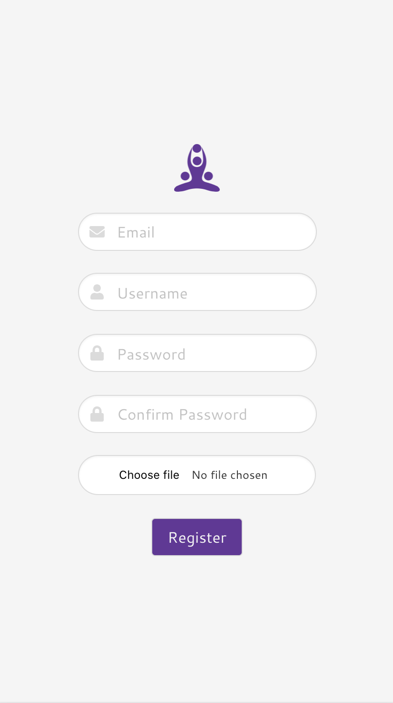
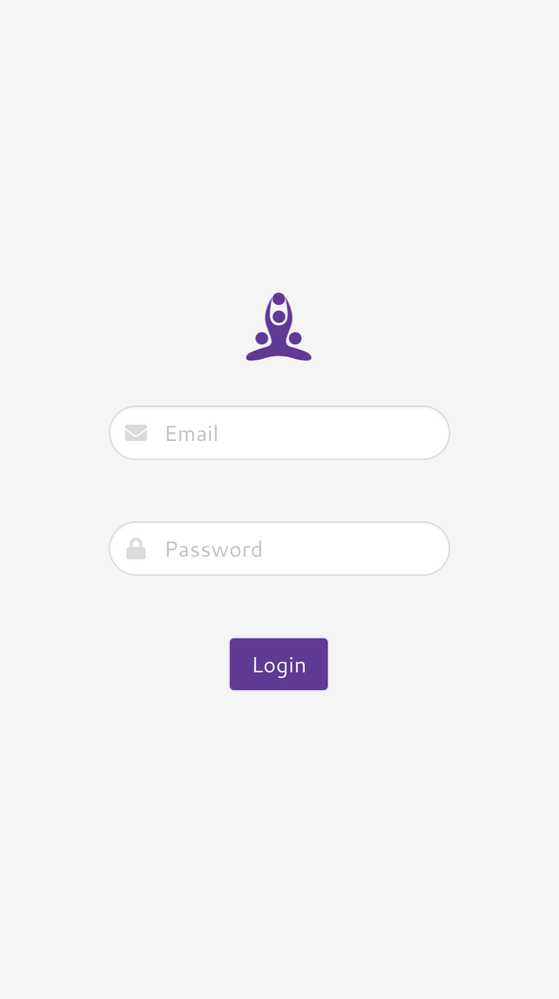
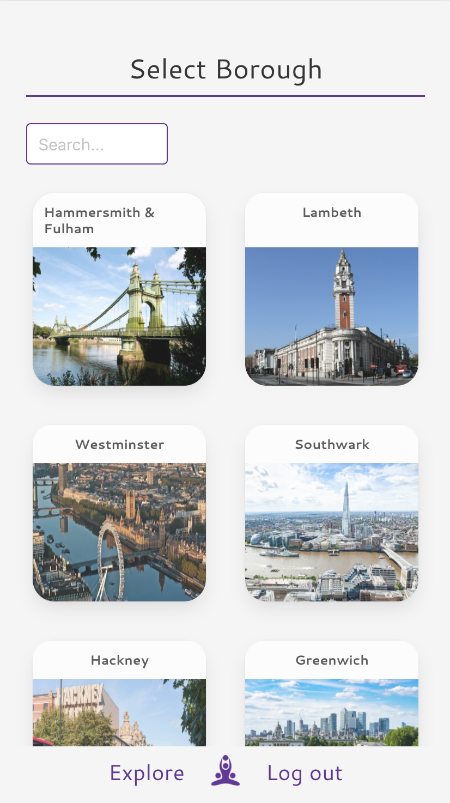
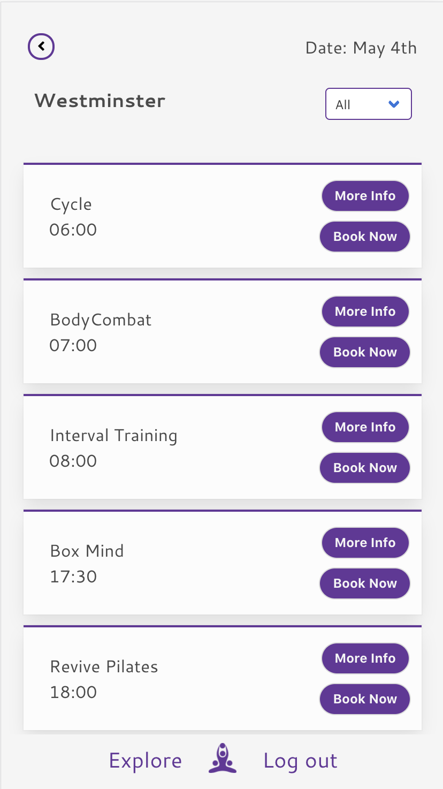
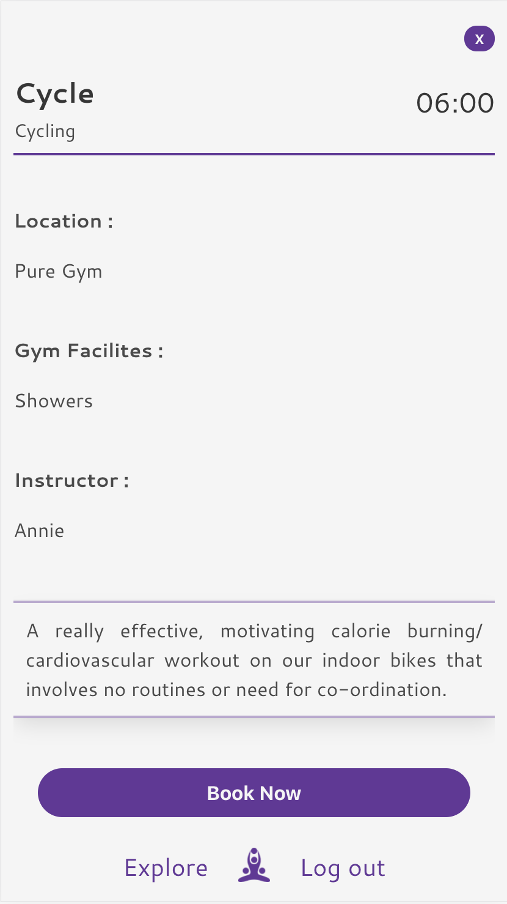

##  General Assembly, Software Engineering Immersive
# Fitbook

by [Lucy Maitland](https://github.com/lucymait) and [Annie Kayal](https://github.com/annie-kayal)

## Overview

Fitbook was my fourth project, with General Assembly, during the software engineering immersive course. I chose to work in a pair with the aim to build a **full-stack application** within **one week**.

After lots of planning, we decided to create a fitness class booking app, where users can:

- Search, Find & Book Fitness classes
- View a list of fitness classes, in your area and filter by activity-type (Yoya, Boxing, HIIT etc.)
- Book any fitness class and view their booking, in their profile page

Check out the app [here](https://fitbook-project.herokuapp.com/#/).

## Brief

- Choose to work solo or in a team
- **Build a full-stack application** by making a backend and front-end
- **Use a Python Django API** using Django REST Framework to serve your data from a Postgres database
- **Consume the API with a separate front-end** built with React
- **Be a complete product** which most likely means multiple relationships and CRUD functionality for at least a couple of models
- **Be deployed online** so it's publicly accessible

## Technologies Used

- JavaScript (ES6)
- React.js
- Python
- Django
- Django REST Framework
- PostgreSQL
- HTML
- CSS, SCSS
- Bulma
- Axios
- Webpack
- Git and GitHub
- Heroku
- Moment
- Google Fonts

# Backend

## Approach 

### Planning & Set Up 

After deciding the idea for the project, we created an Entity Relationship Diagram to determine what relationship models had between them and what type of relationships these would be. This was incredibly important stage to ensure how our database would be built. 

At this stage, we also decided the fields each of our models have within them, as illustrated below:


Having planned our project, we could move on to begin creation. Our first step was to create a Django project containing our two apps. The project contains its own individual set of URLS which we would use to distinguish the API endpoints to retrieve any data in the frontend. The project has its own settings where we configured the apps, middleware, databases, our custom made user model, and authentications for the apps to use. 

Django comes with an in-built CMS whereby an administrative user can directly add, update and delete database records. We used Django REST framework to build the API as it has powerful functionality but allows for customisation all the way down. 

However, in order to access Django’s CMS, a superuser needed to be created aswell as our apps. For each app created, a URL, Model, and Views Python files are automatically created. These newly created apps needed to be included into the main project’s installed apps section to track changes. 

The last step needed in our setup was to configure our database to be PostgreSQL. By default, Django will use SQLite. To change this, we had to modify the database section in the main project settings to use PostgreSQL by providing the database name and altering our engine to be PostgreSQL. 


## Models

Having set up the project, we could look forward to building our two apps. The first step was creating models per app and ensuring these were correct to avoid continuously dropping and recreating the database. Once every model was created, they each also have be registered in the admin.py file for which app they were built in. 

### 1. FITNESS

For our fitness app, a total of five tables were created in the database, as shown in our ERD above.

- Some models were created simply to provide variety in our app i.e. Our Instructor table held a total of 10 instructors, which we used in the fitnessClass model as a one-to-one relationship to indicate one instructor per class. A similar approach was also taken for our Gym model:

<table>
<tr>
<th>

```js
class Instructor(models.Model):
  name = models.CharField(max_length=100)

  def __str__(self):
    return f'{self.name}'
```

</th>
<th>
The Instructor table consisted of a name so we could identify the instructor for each fitness class.
</th>
</tr>

<tr>
<td>
<pre>

```js
class Gym(models.Model):
  name = models.CharField(max_length=500)
  facilities = models.CharField(max_length=400)

  def __str__(self):
    return f'{self.name}'
```

</pre>
</td>
<th>
The Gym table also consisted of a name and a facilities field e.g parking, showers or lockers for users. 
</th>
</td>
</tr>
</table>

The fitness app had three main models which held relationships with other models. The fitnessClass, Borough and BookedClass models. 

1. <h4 style='text-decoration: underline'>Fitness Class Model: </h4>

    ```js 
    class FitnessClass(models.Model):
      name = models.CharField(max_length=200)
      gym = models.ForeignKey(Gym, related_name='fitness', on_delete=models.CASCADE)
      activity_type = models.CharField(max_length=500)
      instructor = models.ForeignKey(Instructor, related_name='fitness', on_delete=models.CASCADE)
      description = models.CharField(max_length=1000)
      time_of_class = models.CharField(max_length=200)
      comment = models.ManyToManyField(Comment, related_name='fitness', blank=True)

      def __str__(self):
        return f'{self.name}'
    ```

- The Fitness Class model consisted of a name, gym, activity_type, instructor, description, time_of_class and comments. 

- A comments model was created at the earlier stage of creating the models and to be implemented as a bonus feature for users to comment on classes; however we unfortunately ran out of time before being able to integrate the feature in. Although, now that it is in our model, it will make it much easier to be created in the future.

- The model, had the following relationships: 
  1. A one-to-many relationship with gym model, signifying many fitness classes to one gym;
  2. A one-to-many relationship with instructor, signifying many fitness classes to one instructor;
  3. A many-to-many relationship with comments, signifying there can be many comments to many fitness classes.

2. <h4 style='text-decoration: underline'>Borough Model: </h4>

    ```js
    class Borough(models.Model):
      name = models.CharField(max_length=200)
      image = models.CharField(max_length=1000)
      fitnessclass = models.ManyToManyField(FitnessClass, related_name='fitness', blank=True)

      def __str__(self):
        return f'{self.name}'
    ```

- The Borough table consisted of a name, image and fitnessclasses. The fitnessclass had a many-to-many relationship to the FitnessClass model, to indicate there are many fitness classes in many boroughs.

3. <h4 style='text-decoration: underline'>Booked Class Model: </h4>

    ```js
    class BookedClass(models.Model):
      name = models.CharField(max_length=200)
      gym = models.CharField(max_length=200)
      activity_type = models.CharField(max_length=500)
      instructor = models.CharField(max_length=200)
      description = models.CharField(max_length=1000)
      time_of_class = models.CharField(max_length=200)
      data_booked = models.CharField(max_length=100)
      user = models.ForeignKey(User, related_name='fitness', on_delete=models.CASCADE)

      def __str__(self):
        return f'{self.name}'
    ```
- Finally our BookedClass table consisted of a name, gym, activity_type, instructor, description, time_of_class, date booked and user. 

- The bookedClass model has a one to many relationship with our custom user model, from the JWT Auth App. This shows that each user can have many booked classes. These booked classes can then be displayed in the users profile in the front-end.

### 2. JWT_AUTH

As part of Django’s default authentication, a user is already available for use. However, the model has attributes which accepts only a small number of fields and only one of which is required as true. For this reason, we chose to extend the original model: 

1. 
      ```js
      class User(AbstractUser):
        image = models.ImageField(upload_to='profile_image', blank=True)
        email = models.EmailField(unique=True, error_messages={'unique':"This email has already been registered."})
        ```
- This customised model has two additional fields, the email and the image. Although email is already provided by Django’s default model, it is not required. We also specified unique as also being true. This disables users to register with the same email and prompts the error message shown. The image field allows our users to upload their own image to the database. We allowed users the choice to upload their own photo.


## Serializers

Once the models were created, we needed to create serializers for all of them. This was necessary for Django to communicate with our PostgreSQL database. The purpose of the serializers is converting data. In the database, data is stored as encrypted files. In rendering our data, even from the backend view, these files can be unclear to read. It was necessary to display data that is clear to those who wished to use the API. 

In our instance, we chose to display the data in JSON format and if submitted to the database in JSON format, the serializer would convert this to be stored appropriately in the database and when retrieved from the database, the data would be deserialized and turned into JSON format. The serializers also validate before it is stored into the database to ensure data meets the criteria outlined.  

### 2. FITNESS

- We created a serializer for each of our models in the fitness app. Although the ModelSerializer method automatically generates the fields in the model we pass through, we decided to include them individually in case we change our models. 

```js
class FitnessClassSerializer(serializers.ModelSerializer):
  class Meta:
    model = FitnessClass
    fields = ('id', 'name', 'gym', 'activity_type', 'instructor', 'time_of_class', 'description', 'comment')
```

- Due to the default behaviour of ModelSerializer to display relationships with only the primary key, we used nested serializers to allow all information to be displayed per relationship. This was done by defining the fields as being their own serializers and then passing them through into the fields as shown below. This was needed specifically for fitnessClass model to display the instructor, gym and comments and also for the Borough in order to display the classes. 

```js
class PopulateFitnessClassSerializer(serializers.ModelSerializer):
  instructor = InstructorSerializer()
  gym = GymSerializer()
  comment = CommentSerializer(many=True)

  class Meta:
    model = FitnessClass
    fields = ('id', 'name', 'gym', 'activity_type', 'instructor', 'time_of_class', 'description', 'comment')

class PopulateBoroughSerializer(serializers.ModelSerializer):
  fitnessclass = PopulateFitnessClassSerializer(many=True, required=False)
  class Meta:
    model = Borough
    fields = ('id', 'name', 'image', 'fitnessclass')
```

### 2. JWT_AUTH

Although we only had one model in our JWT_auth app, we decided to add an additional level of authentication in the the serializer to run when data is submitted. This was a validation to check password authentication. 

Although Django does come with its own set of requirements for passwords, our `validate` method creates an extra measure to check if the password and password confirmation field match and if any other error messages appear, to raise them and return them. 


```js
class UserSerializer(serializers.ModelSerializer):

    password = serializers.CharField(write_only=True)
    password_confirmation = serializers.CharField(write_only=True)

    def validate(self, data):

        password = data.pop('password')
        password_confirmation = data.pop('password_confirmation')

        if not password:
            raise serializers.ValidationError({'password': 'Not a valid Password'})

        if password != password_confirmation:
            raise serializers.ValidationError({'password_confirmation': 'Passwords do not match'})

        try:
            validations.validate_password(password=password)
        except ValidationError as err:
            raise serializers.ValidationError({'password': err.messages})

        data['password'] = make_password(password)
        return data 

    class Meta:
        model = User
        fields = ('id', 'username', 'email', 'image', 'password', 'password_confirmation','fitness')
        extra_kwargs = {
          'fitness' : {'required': False}
        }
```

We also needed to specify the fitness field as being required as false. This is because the fitness field is not inputted into the custom user model upon registeration and would automatically raise the data as invalid.

## Views

Now being able to store and access data that is viewable, we were now able to look at how our API information would return our data. We implemented Django REST framework to create the views to render our backend data and enable CRUD functionality. 

### 1. FITNESS

At this point, we had to decide what requests users could make. Due to the nature of the app, it was clear users would be able to make GET requests to all of the endpoints, but would be limited to which tables they would be able to delete or create with. For this reason, we only chose to use class-based views in our fitness app so we could determine the delete and create endpoints for the users. 

One area we did need to implement in this app is permissions. In order to access most of the information on the app, they needed to be a registered user. Django REST framework already gives us access to some powerful permissions, which can be added to any view by passing them as a list or tuple to a permission_classes property. However, we also created another custom permission setting. 

```js
class IsOwnerOrReadOnly(BasePermission):
  def has_object_permission(self, request, view, obj):
    if request.method in permissions.SAFE_METHODS:
      return True
    
    return request.user == obj.user
```
- `isOwnerOrReadOnly` overrides the `BasePermission`. What this does is allow users read-only access to the endpoint, however even if they are authenticated, full CRUD functionality is only available to a superuser through the admin panel. 

- This permission was used only for the fitnessClass and fitnessClassDetailView endpoints as this would only b accessible for a superuser to add more classes to the database. However all users have a GET endpoint to view the classes. 

```js
class AllFitnessClassView(APIView):
  permission_classes = (IsOwnerOrReadOnly,)

  def get(self, request):
    fitness_classes = FitnessClass.objects.all()
    self.check_object_permissions(request, fitness_classes)
    serializer = PopulateFitnessClassSerializer(fitness_classes, many=True)
    return Response(serializer.data)

class FitnessClassDetailView(APIView):
  permission_classes = (IsOwnerOrReadOnly,)

  def get(self, request, pk):
    fitness_class = FitnessClass.objects.get(pk=pk)
    self.check_object_permissions(request, fitness_class)
    serializer = PopulateFitnessClassSerializer(fitness_class)
    return Response(serializer.data)
```
For the rest of the endpoints in the fitness app, we specified permissions as using Django REST frameworks `isAuthenticated`. This would mean they would need to be logged in as a user to even have read-only access. 

- The BookedClass endpoint was the only endpoint created where authenticated users could POST and DELETE. This endpoint is used in the front-end for users to book their fitness classes using a POST request, or to DELETE a singular class if they could no longer attend. 

```js
class BookedClassesView(APIView):
    queryset = BookedClass.objects.all()
    serializer_class = BookedClassSerializer
  permissions_classes = (IsAuthenticated, )

  def post(self, request):
    request.data['user'] = request.user.id
    booked_class = BookedClassSerializer(data = request.data)
    if booked_class.is_valid():
      booked_class.save()
      return Response(booked_class.data, status=HTTP_202_ACCEPTED)
    return Response(status=HTTP_422_UNPROCESSABLE_ENTITY)

class BookedClassDetailView(APIView):
  def get(self, request, pk):
    booked_class = BookedClass.objects.get(pk=pk)
    serializer = BookedClassSerializer(booked_class)
    return Response(serializer.data)

  def delete(self, request, pk):
    booked_class = BookedClass.objects.get(pk=pk)
    booked_class.delete()
    return Response(status=HTTP_204_NO_CONTENT)
```

### 2. JWT_AUTH (User)

1. <h4 style='text-decoration: underline'> Register View </h4>

    ```js
    class RegisterView(CreateAPIView):
        serializer_class = UserSerializer
        def post(self, request):
            serializer = UserSerializer(data=request.data)
            if serializer.is_valid():
                serializer.save()
                return Response({'message': 'Registration successful'})
            return Response(serializer.errors, status=422)
    ```
    - For users wanting to register themselves into the database, this allowed every user a POST request. The data that is passed through this endpoint must be valid against the UserSerializer before being saved into the database and will return the errors if unsuccessful which are then displayed in the front-end. 

2. <h4 style='text-decoration: underline'>Login View </h4>

    ```js
    class LoginView(APIView):
        def get_user(self, email):
            try:
                return User.objects.get(email=email)
            except User.DoesNotExist:
                raise PermissionDenied({'message': 'Not Registered'})
        def post(self, request):
            email = request.data.get('email')
            password = request.data.get('password')
            user = self.get_user(email)
            if not user.check_password(password):
                raise PermissionDenied({'message': 'Incorrect Password'})
            token = jwt.encode({'sub': user.id}, settings.SECRET_KEY, algorithm='HS256')
            return Response({'token': token, 'message': f'Welcome back {user.username}!'})
    ```
    - Once users have successfully registered, they will be able to login and have access to the views in the fitness app. However, this endpoint also decifiers if the user has already registered using the `get_user` function by checking if the email address requested is within the database. If this is passed, the POST request will also run the `check_password` function provided by Django’s default user authentication. If this is all passed, the user is given a JSONWebToken which is stored into the localStorage through the front-end and passes the `isAuthenticated` permission. 


3. <h4 style='text-decoration: underline'> Profile View </h4>

    ```js
    class ProfileView(APIView):
      permission_classes = (IsAuthenticated, )
      def get(self, request):
        user = User.objects.get(pk=request.user.id)
        serialized_user = PopulateUserSerializer(user)
        return Response(serialized_user.data)
    ```

    - All registered users are given their own profile, where all their booked classes would be stored. This is the only endpoint whereby permissions have been enabled and has a single GET endpoint to get the user made the request. This utilises the PopulateUserSerialiser to pull all the data through if any classes have been booked by the user.  

## URLS 

Finally, now we are able to view and make the desired requests per endpoint, the URLS can be written per app. 

In our project we wrote the following urls in order to access per app: 

    urlpatterns = [
        path('admin/', admin.site.urls),
        path('', include('frontend.urls')),
        path('api/fitness/', include('fitness.urls')),
        path('api/', include('jwt_auth.urls'))
    ]

1. FITNESS 

    ``` js
    urlpatterns = [
      path('', AllFitnessClassView.as_view()),
      path('<int:pk>/', FitnessClassDetailView.as_view()),
      path('borough/', AllBoroughView.as_view()),
      path('borough/<int:pk>/', BoroughDetailView.as_view()),
      path('gym/', AllGymView.as_view()),
      path('gym/<int:pk>/', GymDetailView.as_view()),
      path('comment/', AllCommentView.as_view()),
      path('comment/<int:pk>/', CommentDetailView.as_view()),
      path('bookedclass/', BookedClassesView.as_view()),
      path('bookedclass/<int:pk>/', BookedClassDetailView.as_view())
    ]
    ```

  - To access any of the above URLS, users would use `/api/fitness/URL` and the appropriate view would render.

2. JWT_AUTH

    ```js
    urlpatterns = [
        path('admin/', admin.site.urls),
        path('', include('frontend.urls')),
        path('api/fitness/', include('fitness.urls')),
        path('api/', include('jwt_auth.urls'))
    ]
    ```
  - To access any of the above URLS, users would use `/api/URL` and the appropriate view would render.

# Frontend

Having completed our custom built API and ensuring all the relevant information was displaying correctly, focus could now be placed on the UX perspective. Before diving into building the pages, a user story needed to be conceptualized to ensure a smooth and functional app from the user view. 
<div style='text-align:center'>

</div>

Once we were clear on how the user journey would be made, we quickly got started on building our React components.

The nature of this app was to primarily be used on **mobile apps** as users would be likely to view class availability during their day. Because of this, the app was designed to be mobile first. We implemented using a CSS framework into our project in order to focus on the functionality of how the components would work.

## Homepage 

- The homepage was built with limited accessibility for users. In designing our backend, content would only be available to users who had created an account. The landing page therefore prompts users to either create an account or to login using buttons to redirect them to the appropriate page. 
 
<div style='text-align:center'>

</div>

## Registering 

Depending on what the user has selected from the landing page, a redirection is made to either the register or login components. 

- We wanted to be able to allow users to upload their own individual profile pictures to our database which renders in their profile. This was a strict piece of code which unfortunately was unable to be deployed to Heroku as their database ignores image files.

- However, this was achieved locally: 

```js 
    const body = new FormData()

  function handleSubmit(event) {
    event.preventDefault()
    const imageInput = document.getElementsByClassName('image-field')
    const image = imageInput.image.files
    body.append('email', registerData.email)
    body.append('username', registerData.username ? registerData.username : '')
    body.append('password', registerData.password ? registerData.password : '')
    body.append('password_confirmation', registerData.password_confirmation ? registerData.password_confirmation : '')
    body.append('image', image.length === 0 ? registerData.image : image[0])
    axios.post('/api/register',
      body)
      .then(() => {
        const login = new FormData()
        login.append('email', registerData.email)
        login.append('password', registerData.password)
        axios.post('/api/login', login)
          .then(resp => {
            auth.setToken(resp.data.token)
            props.history.push('/profile')
          })
      })
      .catch(err => {
        setErrors(err.response.data)
      })
  }
```

  - To enable this feature for our users, an important aspect was **accessing the file uploaded**. 

  - In retrieving this, we used DOM manipulation to access the input that was rendered on the page using the class that was assigned to it. 

  - Reviewing the element in the console, we were able to locate the image itself, shown as the variable `image’ which stored the image within an array. 

  - However, we needed to be able to send this image as well as the other registered information in the shape of a form. To do so, we used the `FormData` method. 

  - As the image is the last input to be completed by the user, all the other information inputted by the user to register was stored into state. We were able to append all the information the user inputted to the `FormData` and send this as a request to our API. 

### Error Handling

Displaying error messages to users on the register and login components was another feature we added into the frontend. We thought this would be key as users would be able to identify why they were unable to register or login so they were able to take the right steps. 

  - Because of the design of the register and login views, a response using Django was able to be retrieved with why a user would not have been able to register or login. We were able to store this within state and display this using `ternary operators` per input: 

  ```js
  {errors.email ? <p>{errors.email[0]}
   </p> : null}
  ```
<div style='text-align:center'>


</div>


  ## Profile 

  For every user who created an account, they would also be given their own profile page. From there they were able to access all functionalities of the app including booking and deleting classes. 

As mentioned before, users were given the opportunity to upload an image from their computer into the database. This photo would be displayed on this page. 

However, it wasn’t required for users to upload an image if they chose not for their own reasons. To avoid a blank space to be in place where the uploaded photo would be, we decided to implement a default image to be in place if this was the case using a `ternary operator` as the image source: 

```js 

```
As mentioned, this was successful in the development stages of the project, however Heroku does not allow image uploads. 

The profile also contained another `ternary operator` to display if the user had booked any classes. By deciding to put a button in place to browse through boroughs, users are immediately prompted and this fills a blank space on the page. 

The screenshots below are taken from the development stage to illustrate the image operator at work: 

<div style='text-align:center'>


</div>

## Borough & Class Filtering

Now that users have access to all the app functionality, they are able to browse through the Boroughs that are available on the app. We decided to implement 12 Boroughs as a whole to demonstrate how the page would look with multiple boroughs available and when the page scrolls; other components would not be affected and the design would stay intact. 

A feature often seen on pages where multiple choices are available, such as our boroughs, a filtration is available for users to quickly find one of their choosing. We also decided to use this for enhanced user experience.  Our filtering technique finds any borough on their name. 

Achieving this required three pieces of state to be used: 

`boroughs` - to store all the boroughs </br>
`filteredBoroughs` - to store all the boroughs as well </br>
`query` - to store what is typed by the user when they search

  As well as the following steps:

  1. Once the page renders, a GET request is made to the ALL boroughs endpoint and this is stored into the `boroughs` and `filteredBoroughs` state. 

  2. In the render method, a search form is visible which also has a `onChange` event handler, where the `filteredBoroughs()` function is called:

  ```js
    filterBoroughs(event) {
    const searchQuery = event.target.value
    const filteredBoroughs = this.state.boroughs.filter(borough => {
      const regex = new RegExp(searchQuery, 'i')
      return borough.name.match(regex)
    })
    this.setState({
      query: searchQuery,
      filteredBoroughs: filteredBoroughs
    })
  }
  ```

  3. This function targets our input value within the search form, which we have given the state `query`. 

  4. The `filter` function is then applied to the `filteredBorough` state and stored into a variable. This returns names which match the letters in any Borough name through the `match()` method. 

  5. During this, the state of `query` and `filteredBoroughs` are reset. The `query` is set to be the input value and `filteredBoroughs` is set to be the variable where the filter method was applied. 

We also applied a filter once a user selects a Borough they would like to book a class in. This filter allows the user to view classes by the class type, i.e HIIT. 

This filter took a slightly different approach and used options to filter through the classes available rather than by freely typing. 

First, we needed to render a drop down onto the page with values that are the class types: 

<table>
<tr>
<th>
Code Snippet
</th>
<th>
Rendered
</th>
</tr>

<tr>
<td>
<pre>

```js
            <select onChange={(e) => filterClasses(e)}>            
              <option value="All">All</option>
              <option value="Yoga">Yoga</option>
              <option value="HIIT">HIIT</option>
              <option value="Barre">Barre</option>
              <option value="Dance">Dance</option>
              <option value="Pilates">Pilates</option>
              <option value="Boxing">Boxing</option>
              <option value="Cycling">Cycling</option>
            </select>
```

</pre>
</td>
<td>
<pre>

</pre>
</td>
</tr>
</table>


The select element has an `onChange` attached it, whereby the filtering function will run: 

```js
  function filterClasses(e) {
    const chosenClass = e.target.value
    if (e.target.value === 'All') {
      setFilteredClass(AllfitnessClasses)
    } else {
      const filteredClasses = AllfitnessClasses.filter(classes => {
        return classes.activity_type === chosenClass
      })
      setFilteredClass(filteredClasses)
    }
  }
```
This function runs in a similar way to the filtering on the Borough page. However, in this instance, we take the value of the option and apply the `filter` method to all the fitness classes within that borough and return the classes matching the value. 

### Home Page
 <br/>

### Register Page


### Login Page


### Borough Page


### Fitness Classes Page


### Single Fitness Class Page


### Booking Confirmation Page


### Profile Page


## Potential Future Features

- To implement comments to each fitness class. Users could comment on the class if they attended it and give their opinion on it.
- At the moment however many people can book onto a class. In reality, fitness classes have limit to how attendees. This would be great to implement to visually show users if a class was full, if the max number was met, and if a space was to open up, the class would be available to be booked again.  
- At the moment, the app focuses on booking classes which are in 24 hours. We would like to implement classes for the week. 
- A user being able to delete their account.
- A chat feature where users could interact with an instructor if they wanted personal training. 

## Lessons Learned

- The importance of designing your models and the fields correctly was a great lesson learnt. In development, by ensuring these are correct it will make accessing and making requests to the API. 

- Importance of configuring Django early, e.g. configuring Images. Implementing images was done very late on during the process and required a configuration to the backend. It would've been wiser to have investigated this earlier to ensure our project was set up correctly. 

- The importance of creating a fixture file early on. Experimenting with data became incredibly difficult to keep track of, whilst testing to ensure all the functionality worked in the frontend correctly. If a fixtures file was made earlier, we would have spent more time focusing on creating the functionality. 